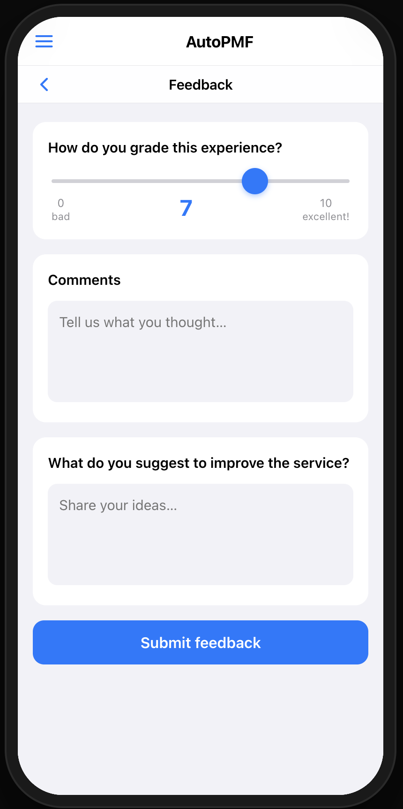
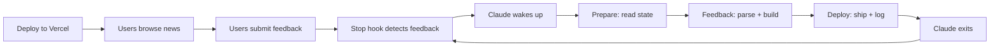

# Auto PMF

Automate the Product Market Fit cycle. Feedback in, product out.

<p align="center">
  
  
</p>

## How Feedback Drives the Product

AutoPMF is built around one idea: **users shape the product, not developers**. The app serves an AI-curated news feed, and after browsing, users are asked to grade their experience on a 0–10 scale (NPS-style) and leave open-ended comments — what they liked, what felt off, and what they'd improve. A second prompt asks specifically for suggestions to make the service better.

This feedback is the engine of the entire system. Every 10 minutes, an AI agent reads all new feedback, identifies patterns, and autonomously updates the app's master prompt (`product.md`) — the single file that governs what content is shown and how the app behaves. The changes are committed, pushed, and redeployed automatically. No human reviews or approves the changes. The cycle repeats until users consistently rate the experience 9+ out of 10, at which point the app has reached Product-Market Fit.

## Local Development

```bash
npm install
cp .env.example .env   # then fill in your keys
source .env && npm start
```

The app runs at `http://localhost:3200`. For watch mode: `source .env && npm run dev`

## Deploy to Vercel

### 1. Import in Vercel

1. Go to [vercel.com/new](https://vercel.com/new)
2. Import your GitHub repository
3. Vercel auto-detects the configuration from `vercel.json`

### 2. Set Up Blob Storage

```bash
vercel blob create-store feedback --access private
vercel env pull   # pulls BLOB_READ_WRITE_TOKEN into .env.local
```

### 3. Add Environment Variables

In the Vercel dashboard under **Settings > Environment Variables**:

| Variable | Required | Description |
|----------|----------|-------------|
| `ANTHROPIC_API_KEY` | Yes | Your Anthropic API key (starts with `sk-ant-`) used for all Claude requests |
| `FEEDBACK_SECRET` | Yes | A secret token you choose. Used as Bearer token to access `GET /get/feedback` |
| `DEPLOY_URL` | Yes | Your Vercel production URL (e.g. `https://autopmf.vercel.app`). Used by `getFeedback.sh` |
| `BLOB_READ_WRITE_TOKEN` | Yes | Auto-created when linking the blob store. Used for Vercel Private Blob Storage |

### 4. Deploy

```bash
vercel --prod
```

## Feedback API

Feedback is stored as JSONL in Vercel Private Blob Storage. To retrieve all collected feedback:

```bash
curl -H "Authorization: Bearer $FEEDBACK_SECRET" https://your-domain.com/get/feedback
```

To mark all entries as processed:

```bash
curl -X POST -H "Authorization: Bearer $FEEDBACK_SECRET" https://your-domain.com/api/feedback/mark-processed
```

Or use the helper script which does both:

```bash
./getFeedback.sh
```

## The AutoLoop — Self-Improving Cycle

AutoPMF continuously improves itself through a feedback-driven loop. When new user feedback arrives, Claude reads it, updates the app, and redeploys — no human in the loop. Built as a [Claude Code plugin](https://code.claude.com/docs/en/plugins) using the [Ralph Wiggum technique](https://github.com/anthropics/claude-code/tree/main/plugins/ralph-wiggum) for iterative, self-referential AI development loops.



### Run it

```
/autoloop
```

That's it. The plugin handles everything:

1. **Prepare** — Reads the codebase, checks deployment health, establishes NPS baseline
2. **Feedback** — Fetches new feedback, plans the change, builds it
3. **Deploy** — Commits, pushes, deploys to Vercel, logs the cycle
4. **Wait** — A stop hook polls for new feedback every 10 minutes. Claude only wakes when at least 1 new feedback entry arrives.

To stop the loop:

```
/cancel-autoloop
```

### How it works (Ralph Wiggum pattern)

Unlike a traditional sleep-loop inside the conversation, AutoLoop uses Claude Code's **Stop hook** to control the cycle:

- Claude runs **one cycle** (prepare, feedback, deploy), then exits
- The stop hook intercepts the exit and **polls `getFeedback.sh`** every 10 minutes
- Only when **new feedback is detected** does the hook re-inject the prompt (exit code 2)
- Claude wakes up with full context and processes the next cycle
- This means Claude never wastes tokens on sleeping — it only runs when there's work to do

### Plugin structure

```
.claude-plugin/plugin.json         # Plugin metadata
commands/
  autoloop.md                      # /autoloop — orchestrates the 3 phases
  autoloop-prepare.md              # Phase 1: read state, check deployment
  autoloop-feedback.md             # Phase 2: fetch, parse, plan, build
  autoloop-deploy.md               # Phase 3: commit, push, deploy, log
  cancel-autoloop.md               # /cancel-autoloop — stop the loop
hooks/
  hooks.json                       # Stop hook registration
  stop-hook.sh                     # Core: polls for feedback, sleeps, re-injects
scripts/
  setup-autoloop.sh                # Initialize state file on first run
  autoloop-cycle.sh                # Orchestrator: poll, ship, log, advance, status
  parse-feedback.py                # Incremental feedback parser with regression detection
```

### Key files

| File | Role |
|------|------|
| `product.md` | Master prompt — governs all news content and behaviour. Updated every iteration |
| `autoloop.md` | Iteration log, rules, and stop conditions |
| `Feedback.txt` | Historical feedback archive with iteration markers |
| `feedback.jsonl` | Raw JSONL feedback (used by stop hook to detect new entries) |
| `.last_cycle` | Line-number bookmark + cycle number for incremental feedback parsing |
| `results.tsv` | Machine-readable experiment log (cycle, date, NPS, status, description) |
| `.claude/autoloop-state.local.md` | Loop state (cycle number, session ID). Deleted on cancel or PMF |

### Stop conditions

1. **PMF reached** — 3 consecutive cycles with NPS >= 9.0
2. **User cancel** — `/cancel-autoloop`
3. **Deploy failure** — 2 consecutive `vercel --prod` failures
4. **No feedback for 24 hours** — Stop hook gives up after 144 polls

## Notes

Additionally you can verify changes before pushing to prod using Claude's built-in browser and inspect tools.

### Suggested Permission file

```json
{
  "permissions": {
    "allow": [
      "Bash(export PATH=\"/opt/homebrew/bin:$PATH\")",
      "Bash(vercel env:*)",
      "Bash(vercel --prod --yes)",
      "Bash(ANTHROPIC_API_KEY=test-key node -e \":*)",
      "Bash(bash:*)",
      "Bash(git checkout:*)",
      "Bash(git add:*)",
      "Bash(git commit -m ':*)",
      "Bash(git push:*)",
      "Bash(vercel --prod)",
      "WebFetch(domain:auto-pmf.vercel.app)",
      "Bash(vercel ls:*)",
      "mcp__Claude_Preview__preview_start",
      "Skill(autoloop-prepare)",
      "Skill(autoloop-prepare:*)",
      "Skill(autoloop-feedback)",
      "Skill(autoloop-feedback:*)",
      "Skill(autoloop-deploy)",
      "Skill(autoloop-deploy:*)"
    ]
  }
}

```

